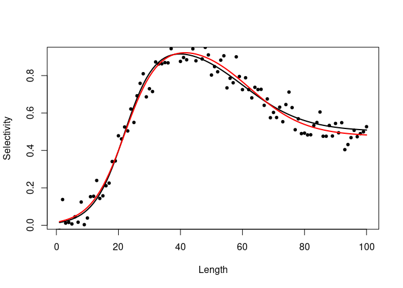

Description
-----------

This package allows you to explore using the double logistic function
for describing the selectivity pattern for use in length- and age-based
fisheries assessment models. The double logistic function is useful
because the standard logistic or sigmoidal selectivity curve is a
special case of the double logistic for some parameter configurations.
The double logistic can allow for dome shaped selectivity.

It is a six parameter model and therefore it is quite demanding. So for
example for a catch at age model where there are 6 or less age classes
for which selectivity is estimated, it is better just to estimate
selectivity for each age as it is more flexible and may even use less
df. I suspect this is why it is not used that much in model fitting
though SS3 uses it. For length based models or when trying to
catchability\*selectivity correct an abundance at length survey time
series, then this kind of selectivity function could be more useful.
Whatever, the case it is useful to see how the parameters affect the
shape of the curve.

The double logistic function
----------------------------

A double logistic function can be written in several different ways. It
is the product of two logistic curves and some of the parameterisations
seem fairly intuitive while less so for others. The one used here is

$$S\_L=\\frac{\\Omega\_{max}}{1+e^{(-\\alpha\_1\\cdot (L-\\beta\_1)}}\\cdot \\frac{1-\\Omega\_{min}}{1+e^{(-\\alpha\_2\\cdot (L-\\beta\_2))}}$$

Where *S**L* is the selectivity at length, L is length,
*α*1 is the slope of the first (ascending) logistic curve
*α*2 is the slope of the second (descending) logistic curve,
*β*1 is the inflection point of the first (ascending)
logistic curve, *β*2 is the inflection point of the second
(descending) logistic curve, *Ω**m**a**x* is the maximum
selectivity level of the curve for simple logistic and
*Ω**m**i**n* is the minumum asymptotic selectivity level of
the curve.

This parameterisation contains the intuitive points that a fisheries
modeller would think about when trying to develop a selectivity curve
for a particular species, stock and gear type.

The inflection points are the points of maximum steepness of each of the
selectivity curves, i.e. the minimum length of fish where the majority
are caught by the gear. The slopes describe how much selectivity changes
for a unit change in size, i.e. how quickly (in terms of fish length) a
gear goes from low to high selectivity for individuals. The first slope
describes the initial increase in selectivity while the second describes
the descending part of the curve if it is dome shaped. The slopes and
inflections together tend to describe the width of the plateau in
selectivity of a dome shaped curve. The final parameter is the
asymptotic selectivity level for a dome shaped curve. If you want just a
simple logistic curve you can set
*Ω**m**i**n*=*Ω**m**a**x*.

Install and load package
------------------------

    library(devtools)
    install_github("duplisea/dublogistic")

Load the package

    library(dublogistic)

Explore the doming minimum asymptote (minsel.upper)
---------------------------------------------------

We start with the doming aspect of the double logistic because it is
likely the reason you would be considering it. This is done by changing
the parameter minsel.upper (miniumum selectivity of the upper part of
the curve).

    L= 1:100
    sel= dublogistic.f(L=L, inflection1=22, inflection2=60, slope1=0.2, slope2=0.1, max.sel=1, minsel.upper=1, plot=T)
    lines(dublogistic.f(L=L, inflection1=22, inflection2=60, slope1=0.2, slope2=0.1, max.sel=1, minsel.upper=0.75, plot=F))
    lines(dublogistic.f(L=L, inflection1=22, inflection2=60, slope1=0.2, slope2=0.1, max.sel=1, minsel.upper=0.5, plot=F))
    lines(dublogistic.f(L=L, inflection1=22, inflection2=60, slope1=0.2, slope2=0.1, max.sel=1, minsel.upper=0.25, plot=F))
    lines(dublogistic.f(L=L, inflection1=22, inflection2=60, slope1=0.2, slope2=0.1, max.sel=1, minsel.upper=0, plot=F))

You can see that by changing the asmyptotic selectivity for large sizes,
it also changes the maximum selectivity lelvel of the curve even though
that max is set equal to 1. You may need to play around with it. There
is possibly an analytic formulation which preserve the maximum parameter
as a function of the asymptotic selectivity value. Just eye-balling it,
it looks like square root or perhaps just a ratio.

Explore the influence of inflection point of the second curve
-------------------------------------------------------------

    L= 1:100
    sel= dublogistic.f(L=L, inflection1=22, inflection2=80, slope1=0.2, slope2=0.1, max.sel=1, minsel.upper=0.5, plot=T)
    lines(dublogistic.f(L=L, inflection1=22, inflection2=50, slope1=0.2, slope2=0.1, max.sel=1, minsel.upper=0.5, plot=F))
    lines(dublogistic.f(L=L, inflection1=22, inflection2=60, slope1=0.2, slope2=0.1, max.sel=1, minsel.upper=0.5, plot=F))
    lines(dublogistic.f(L=L, inflection1=22, inflection2=70, slope1=0.2, slope2=0.1, max.sel=1, minsel.upper=0.5, plot=F))
    lines(dublogistic.f(L=L, inflection1=22, inflection2=40, slope1=0.2, slope2=0.1, max.sel=1, minsel.upper=0.5, plot=F))

Example of how to fit the double logistic to a data set (mock data that you generate)
-------------------------------------------------------------------------------------

The black line is the real curve and the red the fitted line. It is
really difficult to fit in reality so starting values matter a lot. The
example only adds a small amount of noise and it can be interesting to
explore how well it fits with more noise (try it). I found that when the
sd of the normal noise is 0.25 or greater, nls cannot converge.

    L=1:100
    sel= dublogistic.f(L=L, inflection1=22, inflection2=60, slope1=0.2, slope2=0.1, max.sel=1, minsel.upper=0.5, plot=T)
    fit.data=sel
    fit.data$selectivity= fit.data$selectivity+rnorm(length(fit.data$selectivity),0,.05)
    names(fit.data)= c("L","sel")
    points(fit.data, pch=20)
    dl.formula= as.formula(sel~(max.sel/(1+exp(-slope1*(L-inflection1))))*(1-minsel.upper/(1+exp(-slope2*(L-inflection2)))))
    dl.fit= nls(dl.formula,data= fit.data, start=list(inflection1=20, inflection2=70, slope1=.3, slope2=.05, max.sel=1, minsel.upper=.5))
    lines(fit.data$L,predict(dl.fit),col="red",lwd=2)

You can also fit a double logistic using the sicegar library which has a
more sophisticated approach to fitting the model and also distinguishes
if a dataset is best fit with a logistic or double logistic. Apparently,
it is a common problem in cell and bacterial growth modelling in medical
sciences.

Fit a double logistic using the R package sicegar
-------------------------------------------------

So let’s fit it with sicegar (I copied these code lines from the sicegar
vignette). This makes a pretty ggplot graph and it also fits the data
properly. The sicegar model fits a different parameterisation of the
model though and I have not gone through to see how those parameters
relate to one used above.

    library(sicegar)

    dataInput= data.frame(time=fit.data$L,intensity=fit.data$sel)
    fitObj <- fitAndCategorize(dataInput,threshold_minimum_for_intensity_maximum = 0.3,threshold_intensity_range = 0.1, threshold_t0_max_int = 0.05)

    sicegar.fit <- figureModelCurves(dataInput = fitObj$normalizedInput,doubleSigmoidalFitVector= fitObj$doubleSigmoidalModel, showParameterRelatedLines = TRUE)
    sicegar.fit$labels$y="Selectvity"
    sicegar.fit$labels$x="Length (cm)"
    plot(sicegar.fit)

References
----------

Caglar et al. (2018), Sicegar: R package for sigmoidal and
double-sigmoidal curve fitting. PeerJ 6:e4251; DOI 10.7717/peerj.4251

